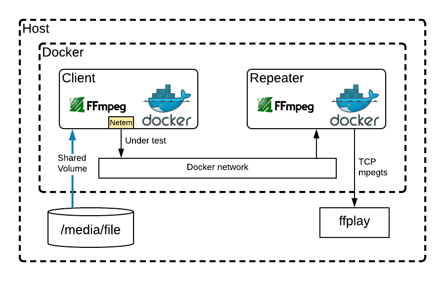

# live-streaming-ingest-simulation
This project (script) allows you to simutale a noisy live streaming contibuition inside your laptop / workstation visualizing the problems in real time.

## Introduction
This script uses the docker image [jcenzano/docker-ffmpeg](https://hub.docker.com/r/jcenzano/docker-ffmpeg/) to stream a file (simulating a live stream) using one of those protocols (**udp, rmtp, srt**) to a destination, in this case another docker container.
It also allows you to introduce any kind of network problems (packet loss, delay, corruption, reordering, duplication, rate limiting) to the live stream and visually see the results.



This code has been really useful to me to test different ingest protocols and tune their configurations.

It is also useful for training purposes, I think it is very handy to see how each protocol react to different network problems.

Another interesting usage that I found is to simulate real ingest links. For instance you could:
1. Get BW, RTT, Jitter, Loses for any link using [iperf](https://github.com/esnet/iperf) and ping (*)
2. Set those params to the simulation
3. Visualize how your ingest link will perform with those network conditions
4. Adjust your protocol settings to fix those problems

(*) Be careful internet conditions changes over time.

Going deeper in the implementation we can say that the media file is NOT transcoded, it is just real time transmuxed to one of the following formats based on the selected protocol:
- RTMP: Format flv
- UDP: Format mpegts
- SRT: Format mpegts

## Instalation
- Dependencies: [docker](https://www.docker.com/), [NodeJS(V10+)](https://nodejs.org/en/), [ffplay](https://ffmpeg.org/ffplay.html)
- Clone this repo:
```
git clone git@github.com:jordicenzano/live-streaming-ingest-simulation.git
```

## Usage
- Execute `./start-simulation.js`
(Probably first execution will take a while because it will pull the docker container, if you want to speed up that process you could do `docker pull jcenzano/docker-ffmpeg` first)

- To see usage instructions you can call the script without arguments:
```
Use:
./start-simulation.js PROTOCOL(rtmp, udp, SRT, or clean) netemCmd TestDuration(s) MediaTestFile [ffplayCommand(port2010)] [ProtocolParams]

Example UDP:
./start-simulation.js udp "rate 10mbps loss 5% delay 200ms" /test-video/test.ts "ffplay -x 1280 -y 720 -left 1680 -top 10 tcp://0.0.0.0:2010?listen"

Example RTMP:
./start-simulation.js rtmp "rate 10mbps loss 5% delay 200ms" /test-video/test.ts "ffplay -x 1280 -y 720 -left 1680 -top 10 tcp://0.0.0.0:2010?listen"

Example SRT:
./start-simulation.js srt "rate 10mbps loss 5% delay 200ms" /test-video/test.ts "" latency=200
(In this example you have to manually launch ffplay previously)

Example SRT:
./start-simulation.js srt "rate 10mbps loss 5% delay 200ms" /test-video/test.ts "internal" latency=200

Clean example: start-simulation.js clean (it wil make sure all previous containers are stopped

For more info about netem command see: http://man7.org/linux/man-pages/man8/tc-netem.8.html
```

## TODO
- Add FEC (SMPTE 2022) to the test framework
